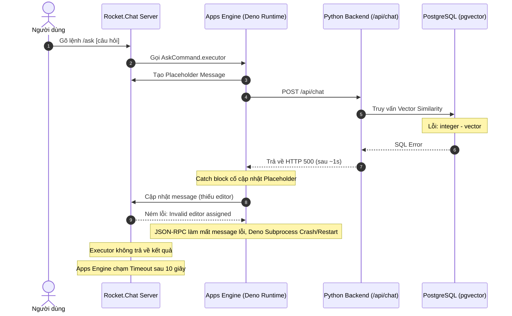

# Kế Hoạch Khắc Phục Lỗi Slash Command & RAG Pipeline (RAGChat)

> **Mục tiêu:** Khắc phục triệt để lỗi timeout 10 giây của Rocket.Chat Apps Engine khi thực thi `/ask` & `/summarize`, sửa lỗi cú pháp SQL pgvector, đảm bảo tính hợp lệ khi cập nhật placeholder message và chuyển đổi kiến trúc sang Asynchronous ARQ Worker + Callback.

---

## 1. Kết Quả Kiểm Chứng & Phân Tích Thực Tế

| Nhận định ban đầu | Đánh giá | Kết luận thực tế |
| :--- | :--- | :--- |
| **App thiếu quyền `api`** | Đúng một phần | Workspace đã thêm quyền `api`, nhưng bản app đang cài đặt trong Rocket.Chat vẫn chưa được cấp quyền này (thay đổi chưa được deploy / cấp quyền lại). |
| **Slash-command timeout** | Đúng | Apps Engine 6.13.0 áp dụng timeout Deno runtime chính xác là **10 giây** (không phải timeout chung chung "vài giây"). |
| **Backend chậm/treo** | Không đúng cho lần `/ask` mới nhất | Backend trả mã lỗi **500** chỉ sau khoảng **1 giây** do lỗi cú pháp SQL pgvector. |
| **`Message must exist...` do response rỗng** | Không đúng | Đây là lỗi thứ cấp của `jsonrpc-lite` khi nhận một `JsonRpcError` có `message: null`. |
| **Payload message cần validate** | Hợp lý để phòng thủ | Cần thiết (defense-in-depth), nhưng không sửa được nguyên nhân gốc hiện tại nếu chỉ thêm validation. |
| **Locale `vi-vn`** | Đúng (Mức thấp) | Không liên quan đến sự cố thực thi `/ask`. |
| **Marketplace 404** | Đúng (Không nghiêm trọng) | Do App là bản private / manually installed nên không tìm thấy metadata trên Marketplace. |
| **AWS / Mongo / API deprecation** | Đúng (Chỉ là cảnh báo) | Cảnh báo deprecation của framework, không gây ra lần thất bại này. |

---

## 2. Chuỗi Nguyên Nhân Thực Tế (Root Cause Chain)



### Bằng chứng theo Timestamp
- **14:17:52Z:** Bắt đầu thực thi `/ask`.
- **14:17:53Z:** Backend trả về **HTTP 500** với lỗi: `operator does not exist: integer - vector`.
- **14:18:00Z:** Deno phát sinh `Uncaught JsonRpcError`, sau đó app được construct/initialize lại (dấu hiệu Deno subprocess vừa bị crash và restart).
- **14:18:02Z:** Apps Engine chạm ngưỡng timeout 10 giây.

---

## 3. Hai Lỗi Chức Năng Trực Tiếp Cần Xử Lý

### 3.1. Lỗi 1: SQL Cosine Similarity sai dấu ngoặc
* **Vị trí:** `backend/src/storage/vectorstore.py:119`
* **Hiện trạng code:**
  ```sql
  1 - embedding <=> CAST(:vec AS vector)
  ```
* **Vấn đề:** PostgreSQL parse biểu thức theo thứ tự ưu tiên tương đương `(1 - embedding) <=> vector`, dẫn đến lỗi toán tử `integer - vector`.
* **Cú pháp chuẩn:**
  ```sql
  1 - (embedding <=> CAST(:vec AS vector))
  ```
  *(Cần sửa đồng bộ ở cả mệnh đề `SELECT` và `WHERE`).*

---

### 3.2. Lỗi 2: Cập nhật Placeholder Message thiếu Editor
* **Vị trí:** Rocket.Chat Apps Engine kiểm tra:
  ```typescript
  if (!message.editor) {
      throw new Error('Invalid editor assigned to the message for the update.');
  }
  ```
* **Hiện trạng:** Bản app đã deploy chưa gọi `builder.setEditor(...)`.
* **Khắc phục:** Tại `src/utils/MessageHelper.ts:64`, bổ sung:
  ```typescript
  builder.setEditor(appUser);
  ```
  Nếu thiếu bước này, cả nhánh thành công lẫn nhánh xử lý ngoại lệ (catch) đều bị từ chối khi cập nhật placeholder.

---

## 4. Đánh Giá Tác Động (Blast Radius Analysis)

Dựa trên phân tích call graph:

* `_dense_search_sync`: **LOW**
  * 1 caller trực tiếp: `_search_sync`
  * 1 execution flow
* `AskCommand.executor`: **LOW** về upstream dependency.
* `BackendClient.post`: **CRITICAL**
  * 6 callers trực tiếp
  * 16 symbols và 11 execution flows bị ảnh hưởng.
* `BackendClient.assertSuccess`: **CRITICAL**
  * 19 symbols và 12 execution flows.
* `updateMessage`: **CRITICAL**
  * 7 callers trực tiếp
  * 10 execution flows.
* `sendMessage`: **CRITICAL**
  * 13 callers trực tiếp
  * 12 execution flows.

> [!WARNING]
> **Khuyến nghị an toàn:** Tuyệt đối không thay đổi timeout hay logic nền tảng chung của `BackendClient.post`, `sendMessage` hoặc `updateMessage` mà không kiểm thử hồi quy trên tất cả các tính năng: `/ask`, `/summarize`, `/search`, `/explain`, `/translate`, Bot DM Mention và Upload document.

---

## 5. So Sánh Các Phương Án Kiến Trúc

### Phương án A: Hotfix tối thiểu
1. Sửa dấu ngoặc biểu thức SQL pgvector.
2. Đảm bảo `updateMessage()` gọi `setEditor(appUser)`.
3. Giữ fallback gửi message mới nếu cập nhật placeholder thất bại.
4. Cập nhật quyền `api` trong `app.json`, tăng app version và deploy lại.
5. Chạy smoke test.
* **Ưu điểm:** Nhanh, can thiệp tối thiểu.
* **Nhược điểm:** RAG/LLM pipeline vẫn chạy đồng bộ trong slash executor (giới hạn cứng 10s). Pipeline RAG thực tế có thể mất từ 3–20s dẫn đến nguy cơ timeout tái diễn khi truy vấn phức tạp.

### Phương án B: Hotfix + Chuyển đổi Asynchronous Job / Callback (Khuyến nghị)
* **Quy trình:**
  1. Áp dụng ngay Phương án A để phục hồi hệ thống.
  2. Tận dụng kiến trúc Redis + ARQ Worker và Callback Endpoint hiện có:
     - `/ask` tạo placeholder, gửi request enqueue job và backend trả về `202 Accepted` ngay (< 2s).
     - ARQ Worker chạy retrieval + LLM độc lập trong background.
     - Sau khi hoàn thành, Worker gọi callback về Rocket.Chat App để cập nhật placeholder (hoặc gửi fallback).
* **Ưu điểm:**
  - Loại bỏ hoàn toàn rủi ro chạm timeout 10 giây của Slash Command.
  - Tận dụng hạ tầng có sẵn (Redis, ARQ, `notify_app()`, `CallbackEndpoint`).
  - Hỗ trợ retry, theo dõi trạng thái tác vụ và correlation ID.
* **Nhược điểm:** Cần cập nhật đồng bộ ở backend, worker và Rocket.Chat app.

### Phương án C: Rocket.Chat Scheduler nội bộ
* Dùng scheduler nội bộ của Apps Engine.
* **Đánh giá:** Không khuyến nghị do processor vẫn chạy trong Deno runtime và chịu giới hạn timeout RPC.

---

## 6. Kế Hoạch Thực Hiện Chi Tiết

### Giai đoạn 1: Hotfix Nguyên Nhân Hiện Tại

#### Task 1: Regression Test & Sửa SQL pgvector
- **Files:**
  - `backend/tests/unit/test_vectorstore.py` (tạo mới)
  - `backend/src/storage/vectorstore.py`
- **Nội dung:**
  - Viết test kiểm tra biểu thức cosine distance có đầy đủ dấu ngoặc cho cả `SELECT` và `WHERE`.
  - Kiểm tra bind parameters (`:threshold`, `:limit`, `:vec`, filter `room_id`).
  - Chạy test đỏ trước:
    ```bash
    rtk uv run pytest tests/unit/test_vectorstore.py -q
    ```
  - Sửa câu truy vấn SQL:
    ```sql
    (1 - (embedding <=> CAST(:vec AS vector))) AS similarity
    ```
    và
    ```sql
    WHERE (1 - (embedding <=> CAST(:vec AS vector))) >= :threshold
    ```
  - Chạy smoke query trực tiếp trên PostgreSQL container để kiểm chứng parser.

#### Task 2: Kiểm Chứng Cơ Chế Cập Nhật Placeholder
- **Files:**
  - `src/utils/MessageHelper.ts`
  - `src/commands/AskCommand.ts`
  - Các slash commands khác sử dụng `updateMessage`.
- **Yêu cầu:**
  1. Validate `messageId` và `text` không rỗng.
  2. Gọi đầy đủ:
     ```typescript
     builder.setText(safeText);
     builder.setEditor(appUser);
     ```
  3. Bọc fallback: Nếu `getUpdater().message()` hoặc `finish()` thất bại, tự động gửi message mới thay vì reject executor.
  4. Ghi log có ngữ cảnh (command, message ID, error type), không log secret hay toàn bộ văn bản nhạy cảm.

#### Task 3: Runtime Validation Tại Ranh Giới Backend (Defense-in-depth)
- **Nội dung:**
  - Bổ sung helper an toàn:
    ```typescript
    function asNonEmptyString(value: unknown, fallback: string): string {
        return typeof value === 'string' && value.trim() ? value : fallback;
    }
    ```
  - Áp dụng validate cho `answer`, `summary`, `explanation`, `translation`, callback message và error message từ backend.

#### Task 4: Đồng Bộ Manifest & Deploy Lại App
- **Files:**
  - `app.json`
- **Quy trình:**
  1. Khai báo quyền `api`:
     ```json
     "permissions": [{ "name": "api" }]
     ```
  2. Tăng version (ví dụ: `0.0.1` → `0.0.2`).
  3. Typecheck và deploy:
     ```bash
     rtk npx tsc --noEmit
     ```
  4. Deploy lên Rocket.Chat (`http://localhost:3001`).
  5. Chấp thuận quyền `api` trong Administration nếu được yêu cầu.
  6. Kiểm tra log để đảm bảo không còn lỗi `lacks the following permissions: ["api"]`.

#### Task 5: Rebuild & Kiểm Thử Backend
- **Thực thi:**
  ```bash
  rtk uv run pytest -q
  rtk uv run ruff check .
  rtk docker compose -f docker/docker-compose.yml up -d --build backend worker
  ```
- **Kịch bản kiểm thử:**
  - `/ask` với tài liệu đã index.
  - `/ask` với câu hỏi không có dữ liệu khớp.
  - `/ask` khi backend giả lập trả về 500.
  - `/summarize`, `/search`, `/explain`, `/translate`.
  - Mention bot và Upload tài liệu kèm callback indexing.

---

### Giai đoạn 2: Chuyển Đổi Sang Asynchronous Job (Loại Bỏ Giới Hạn 10s)

#### Task 6: Endpoint Enqueue Chat Job
- **Files:** `backend/src/api/chat_jobs.py` (tách riêng khỏi `chat.py`)
- **Payload Request:**
  - `request_id` (Idempotency Key)
  - `query`
  - `user_id`
  - `room_id`
  - `thread_id`
  - `placeholder_id`
  - `history`
- **Hành vi:** Enqueue job vào Redis/ARQ và trả về `202 Accepted` kèm `job_id` trong < 2 giây.

#### Task 7: ARQ Worker Chat Job
- **Files:**
  - `backend/src/taskqueue/__init__.py`
  - `backend/src/taskqueue/jobs.py`
- **Hành vi:**
  1. Khởi tạo pipeline RAG và thực thi retrieval + LLM.
  2. Khi thành công: gọi `notify_app("chat_completed", ...)`.
  3. Khi thất bại: gọi `notify_app("chat_failed", ...)`.
  4. Có giới hạn retry callback (không re-run LLM nếu chỉ lỗi callback HTTP).
  5. Log chi tiết `request_id`, `job_id`, latency của retrieval và LLM generation.

#### Task 8: Mở Rộng Rocket.Chat Callback Endpoint
- **Files:**
  - `src/api/CallbackEndpoint.ts`
  - `src/utils/MessageHelper.ts`
- **Hành vi:**
  1. Hỗ trợ các events: `chat_completed`, `chat_failed`.
  2. Xác thực Bearer token, validate schema payload.
  3. Tìm room/user tương ứng.
  4. Cập nhật `placeholder_id` với `setEditor(appUser)`.
  5. Fallback gửi tin nhắn mới nếu placeholder không tồn tại.
  6. Sử dụng `request_id` để tránh tạo duplicate message khi backend retry.

#### Task 9: Chuyển Đổi Slash Commands Sang Pattern Enqueue
- **Files:** `src/commands/AskCommand.ts`
- **Quy trình:**
  1. Validate arguments.
  2. Tạo placeholder message.
  3. Gửi request enqueue sang backend.
  4. Nhận `202 Accepted` và kết thúc executor ngay lập tức (< 2 giây).
  5. Xử lý fallback ngay nếu enqueue thất bại.
  6. Áp dụng tương tự cho `/summarize`, `/explain`, `/translate`.

---

## 7. Tiêu Chí Hoàn Thành Nghiệm Thu (Acceptance Criteria)

- [ ] Lệnh `/ask` gửi placeholder message trong vòng **< 1 giây**.
- [ ] Slash command executor kết thúc hoàn toàn trong vòng **< 2 giây**.
- [ ] Câu trả lời LLM có thể kéo dài **> 10 giây** mà không làm Slash Command bị timeout.
- [ ] Khi Backend gặp lỗi 500, placeholder luôn được cập nhật thành thông báo lỗi rõ ràng.
- [ ] Deno subprocess không bị crash/restart khi update message.
- [ ] Không còn lỗi thiếu quyền `api` trong log của Rocket.Chat.
- [ ] Không còn lỗi cú pháp SQL pgvector `integer - vector`.
- [ ] Cơ chế retry callback không tạo ra tin nhắn trùng lặp.
- [ ] 100% Backend tests, TypeScript typecheck (`tsc --noEmit`) và Smoke tests đều pass.
