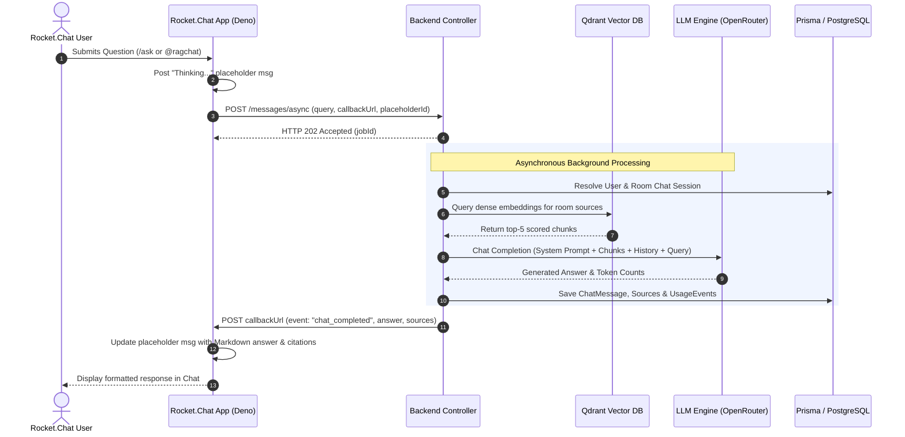
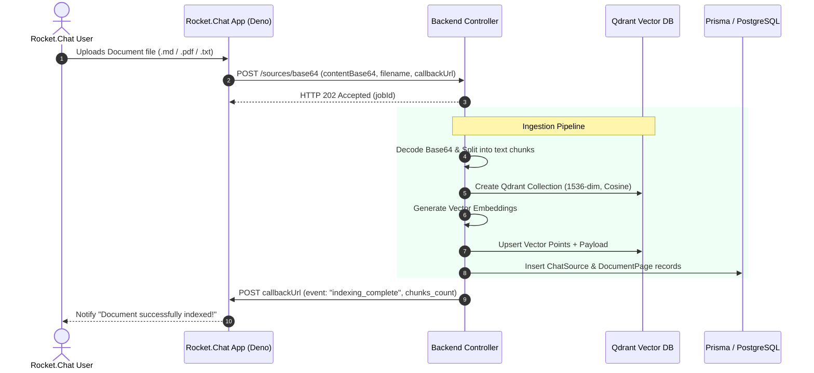

# Rocket.Chat Integration API Contract & Specification

This document provides the definitive, production-accurate API contract between the **Rocket.Chat App** (`src/`) and the **RAGChat Backend Integration Layer** (`backend/`).

---

## Table of Contents

1. [Architecture & System Overview](#1-architecture--system-overview)
2. [Base URL & Authentication](#2-base-url--authentication)
3. [Standard Envelope Formats](#3-standard-envelope-formats)
4. [Identity, Scope & State Resolution](#4-identity-scope--state-resolution)
5. [API Endpoints Reference](#5-api-endpoints-reference)
   - [5.1 POST `/api/v1/integrations/rocketchat/messages/async`](#51-post-apiv1integrationsrocketchatmessagesasync)
   - [5.2 GET `/api/v1/integrations/rocketchat/stats`](#52-get-apiv1integrationsrocketchatstats)
   - [5.3 GET `/api/v1/integrations/rocketchat/sources`](#53-get-apiv1integrationsrocketchatsources)
   - [5.4 DELETE `/api/v1/integrations/rocketchat/sources/:id`](#54-delete-apiv1integrationsrocketchatsourcesid)
   - [5.5 POST `/api/v1/integrations/rocketchat/feedback`](#55-post-apiv1integrationsrocketchatfeedback)
   - [5.6 POST `/api/v1/integrations/rocketchat/sources/base64`](#56-post-apiv1integrationsrocketchatsourcesbase64)
   - [5.7 POST `/api/v1/integrations/rocketchat/utilities/completion`](#57-post-apiv1integrationsrocketchatutilitiescompletion)
6. [Webhook Callback Specification](#6-webhook-callback-specification)
   - [6.1 Event: `chat_completed`](#61-event-chat_completed)
   - [6.2 Event: `chat_failed`](#62-event-chat_failed)
   - [6.3 Event: `indexing_complete`](#63-event-indexing_complete)
   - [6.4 Event: `indexing_failed`](#64-event-indexing_failed)
7. [Sequence & Workflow Diagrams](#7-sequence--workflow-diagrams)
8. [HTTP Status Code & Error Handling Guide](#8-http-status-code--error-handling-guide)

---

## 1. Architecture & System Overview

The Rocket.Chat integration layer is mounted at `/api/v1/integrations/rocketchat` and runs inside the Express backend. It provides a dedicated, headless API surface decoupled from the web application's cookie/JWT authentication.

```
┌─────────────────────────┐                  ┌────────────────────────────────────────┐
│     Rocket.Chat App     │                  │            RAGChat Backend             │
│   (TypeScript / Deno)   │                  │             (Node.js/Express)          │
│                         │                  │                                        │
│  - Slash Commands       │─── HTTP POST ───▶│  Integration Auth Middleware           │
│  - File Upload Handlers │    (Bearer Token)│    - Verifies Integration Token        │
│  - Context Menus        │                  │                                        │
│  - Modal / UI Actions   │◀── HTTP 202 ─────│  Controller (/integrations/rocketchat) │
│                         │    (Immediate)   │    - Validates Zod Schemas             │
│                         │                  │    - Dispatches Async Workflows        │
│                         │                  │                                        │
│  Webhook Callback Recv  │◀── HTTP POST ────│  Background Task Engine                │
│  /api/apps/public/...   │    (Webhook)     │    - Qdrant Vector Search              │
│                         │                  │    - LLM (OpenRouter / OpenAI)         │
│                         │                  │    - Prisma DB & Usage Tracking        │
└─────────────────────────┘                  └────────────────────────────────────────┘
```

### Key Characteristics:
- **Asynchronous Execution:** RAG queries and vector embeddings execute asynchronously, returning `HTTP 202 Accepted` immediately to stay well within Rocket.Chat's 10-second Deno runtime execution limit.
- **Webhook Callbacks:** Long-running jobs push final results to the Rocket.Chat App's public endpoint (`/api/apps/public/<app-id>/callback`).
- **Surface Isolation:** Integration routes operate independently of user-facing web routes (`ENABLE_WEB_ROUTES`).

---

## 2. Base URL & Authentication

### 2.1 Base URL
All Rocket.Chat integration endpoints are mounted under:
```
http://<HOST>:<PORT>/api/v1/integrations/rocketchat
```

### 2.2 Shared Bearer Token Authentication
All incoming requests from Rocket.Chat must include the shared secret integration token in the `Authorization` header:

```http
Authorization: Bearer <ROCKETCHAT_INTEGRATION_TOKEN>
```

### 2.3 Authentication Behavior Matrix

| Environment Configuration | Request Header Present? | Token Matches? | Result / HTTP Status |
| :--- | :--- | :--- | :--- |
| `ROCKETCHAT_INTEGRATION_TOKEN` not set | Any | N/A | `Allowed` (Dev mode warning logged) |
| `ROCKETCHAT_INTEGRATION_TOKEN` set | No | N/A | `401 Unauthorized` (`"Missing Authorization header for integration request."`) |
| `ROCKETCHAT_INTEGRATION_TOKEN` set | Header not `Bearer <token>` | N/A | `401 Unauthorized` (`"Invalid Authorization header format. Expected Bearer token."`) |
| `ROCKETCHAT_INTEGRATION_TOKEN` set | Yes | No | `401 Unauthorized` (`"Invalid integration token."`) |
| `ROCKETCHAT_INTEGRATION_TOKEN` set | Yes | Yes | `200 / 202 Allowed` |

---

## 3. Standard Envelope Formats

### 3.1 Standard Success Envelope (`ApiResponse`)
All successful HTTP responses wrap the payload in a standard structure:

```json
{
  "statuscode": 200,
  "data": {},
  "message": "Operation completed successfully",
  "success": true
}
```

#### Field Definitions:
- `statuscode` (`number`): The HTTP status code (e.g. `200`, `202`).
- `data` (`object`): The response data object.
- `message` (`string`): Human-readable summary of the operation result.
- `success` (`boolean`): `true` when `statuscode < 400`.

### 3.2 Error Envelope (`ApiError`)
When a request fails validation or triggers an error, the Express error-handling middleware returns:

```json
{
  "statusCode": 400,
  "message": "Validation failed: roomId: roomId is required",
  "errors": [
    {
      "field": "roomId",
      "message": "roomId is required"
    }
  ]
}
```

#### Field Definitions:
- `statusCode` (`number`): HTTP error status (`400`, `401`, `403`, `404`, `500`).
- `message` (`string`): Description of the error.
- `errors` (`array`): Array of detailed error objects (populated during schema validation failures).

---

## 4. Identity, Scope & State Resolution

### 4.1 Rocket.Chat User Normalization
Rocket.Chat users are mapped automatically to internal headless `User` records in PostgreSQL via Prisma:
- **Normalized Username Formula:**
  ```
  rc_<normalized_workspaceId>_<normalized_rocketUserId>
  ```
  *Special characters outside `[a-zA-Z0-9_-]` are converted to `_`.*
- **Default Email:** `<normalized_username>@rocketchat.local`
- **User Attributes:** `isVerified: true`, `isAdmin: false`. (No password required).

### 4.2 Room & Thread Chat Session Mapping
Each Rocket.Chat room (and optional thread) resolves to a unique internal `Chat` entity:
- **Chat Name Formula:**
  ```
  RC_<workspaceId>_Room_<roomId>[_Thread_<threadId>]
  ```
- **Source Linking:** Sources uploaded within the room or thread are automatically bound to the chat session for RAG context retrieval.

### 4.3 Documentation URI Scheme
Documents uploaded and indexed via Rocket.Chat use the URI namespace:
```
rocketchat://<workspaceId>/<roomId>/<filename>
```

### 4.4 Idempotency & Deduplication
To prevent duplicate processing caused by network retries or Rocket.Chat event replays, the backend maintains an in-memory LRU cache of `requestId` keys (capacity: 2,000 entries).
- If a repeated `requestId` is received, the backend immediately responds with `HTTP 202` (`data.duplicate: true`) and skips background AI invocation.

---

## 5. API Endpoints Reference

---

### 5.1 POST `/api/v1/integrations/rocketchat/messages/async`

Enqueues a user query for RAG document retrieval and LLM completion. Returns `HTTP 202 Accepted` immediately and dispatches an asynchronous background task.

#### Request Headers
```http
POST /api/v1/integrations/rocketchat/messages/async
Authorization: Bearer <ROCKETCHAT_INTEGRATION_TOKEN>
Content-Type: application/json
```

#### Request Body Schema (`rocketchatAsyncMessageSchema`)

| Field | Type | Required | Default | Description |
| :--- | :--- | :---: | :--- | :--- |
| `workspaceId` | `string` | No | `"default"` | Rocket.Chat workspace or host identifier |
| `rocketUserId` | `string` | **Yes** | — | Rocket.Chat user ID (e.g. `user-123`) |
| `roomId` | `string` | **Yes** | — | Rocket.Chat room ID (e.g. `GENERAL` or `d1f2e3`) |
| `threadId` | `string` | No | `null` | Rocket.Chat thread message ID (if inside a thread) |
| `placeholderId` | `string` | No | `null` | Rocket.Chat temporary "Thinking..." message ID to update |
| `requestId` | `string` | **Yes** | — | Unique client request identifier (e.g. `ask-1788192000-abc123`) |
| `query` | `string` | **Yes** | — | User prompt / question text |
| `history` | `array` | No | `[]` | Array of message objects: `[{ role: string, content: string }]` |
| `model` | `string` | No | `DEFAULT_LLM_MODEL` (`openai/gpt-4o-mini`) | Target LLM model name |
| `provider` | `string` | No | `"DEFAULT"` | LLM provider identifier |
| `callbackUrl` | `string` | No | `null` | Public URL for webhook delivery upon completion |

#### Example Request Body
```json
{
  "workspaceId": "default",
  "rocketUserId": "rocket-user-123",
  "roomId": "GENERAL",
  "threadId": "thread-msg-456",
  "placeholderId": "msg-placeholder-789",
  "requestId": "ask-1788192000-abc123",
  "query": "How do I configure OAuth in Rocket.Chat?",
  "history": [
    { "role": "user", "content": "Hello RAGChat" },
    { "role": "assistant", "content": "Hello! How can I assist you today?" }
  ],
  "model": "openai/gpt-4o-mini",
  "provider": "DEFAULT",
  "callbackUrl": "http://rocketchat:3000/api/apps/public/8a800b09-3cc1-4bc1-8dbf-12592fc223eb/callback"
}
```

#### Response: `HTTP 202 Accepted`

```json
{
  "statuscode": 202,
  "data": {
    "status": "accepted",
    "jobId": "job-ask-1788192000-abc123",
    "requestId": "ask-1788192000-abc123"
  },
  "message": "Message queued for processing",
  "success": true
}
```

*(If duplicate request detected)*:
```json
{
  "statuscode": 202,
  "data": {
    "status": "accepted",
    "jobId": "job-ask-1788192000-abc123",
    "requestId": "ask-1788192000-abc123",
    "duplicate": true
  },
  "message": "Duplicate message request ignored",
  "success": true
}
```

#### Downstream Callback Events
Upon task completion or failure, the backend delivers either [`chat_completed`](#61-event-chat_completed) or [`chat_failed`](#62-event-chat_failed) to the `callbackUrl`.

---

### 5.2 GET `/api/v1/integrations/rocketchat/stats`

Returns aggregated knowledge base statistics, indexed documents summary, and workspace token consumption.

#### Request Headers & Query
```http
GET /api/v1/integrations/rocketchat/stats?workspaceId=default&roomId=GENERAL
Authorization: Bearer <ROCKETCHAT_INTEGRATION_TOKEN>
```

#### Query Parameters Schema (`rocketchatStatsSchema`)

| Parameter | Type | Required | Description |
| :--- | :--- | :---: | :--- |
| `workspaceId` | `string` | No | Filter by Rocket.Chat workspace ID |
| `roomId` | `string` | No | Filter by Rocket.Chat room ID |
| `threadId` | `string` | No | Filter by Rocket.Chat thread ID |

#### Response: `HTTP 200 OK`

```json
{
  "statuscode": 200,
  "data": {
    "documents": [
      {
        "id": "a0000000-0000-4000-8000-000000000001",
        "filename": "Deployment Guide",
        "chunks_count": 12,
        "created_at": "2026-08-31T00:00:00.000Z"
      },
      {
        "id": "a0000000-0000-4000-8000-000000000002",
        "filename": "OAuth Setup.pdf",
        "chunks_count": 8,
        "created_at": "2026-09-01T10:15:30.000Z"
      }
    ],
    "chats": [],
    "usage": {
      "inputTokens": 15200,
      "outputTokens": 8400,
      "totalTokens": 23600
    }
  },
  "message": "Integration stats retrieved successfully",
  "success": true
}
```

---

### 5.3 GET `/api/v1/integrations/rocketchat/sources`

Retrieves a paginated list of indexed sources (knowledge base documents) attached to a specific workspace and room.

#### Request Headers & Query
```http
GET /api/v1/integrations/rocketchat/sources?workspaceId=default&roomId=GENERAL&limit=50
Authorization: Bearer <ROCKETCHAT_INTEGRATION_TOKEN>
```

#### Query Parameters Schema (`rocketchatSourcesQuerySchema`)

| Parameter | Type | Required | Default | Validation |
| :--- | :--- | :---: | :--- | :--- |
| `workspaceId` | `string` | No | `"default"` | Workspace identifier |
| `roomId` | `string` | No | — | Rocket.Chat room ID |
| `threadId` | `string` | No | — | Optional thread ID |
| `limit` | `number` | No | `50` | Min: `1`, Max: `100` |

#### Response: `HTTP 200 OK`

```json
{
  "statuscode": 200,
  "data": {
    "sources": [
      {
        "id": "b1111111-2222-3333-4444-555555555555",
        "filename": "architecture-handbook.md",
        "documentationUrl": "rocketchat://default/GENERAL/architecture-handbook.md",
        "chunksCount": 15,
        "totalPages": 15,
        "createdAt": "2026-09-01T08:00:00.000Z",
        "lastIndexedAt": "2026-09-01T08:00:05.000Z",
        "status": "ACTIVE"
      }
    ]
  },
  "message": "Sources retrieved successfully",
  "success": true
}
```

#### Source Object Attributes:
- `id` (`string`): UUID of the `ChatSource` record.
- `filename` (`string`): Original filename or source heading.
- `documentationUrl` (`string`): Canonical `rocketchat://` URI.
- `chunksCount` (`number`): Number of indexed vector chunks.
- `totalPages` (`number`): Total pages/chunks indexed.
- `createdAt` (`string`): ISO 8601 creation timestamp.
- `lastIndexedAt` (`string`): ISO 8601 indexing completion timestamp.
- `status` (`string`): `"ACTIVE"` if `chunksCount > 0`, otherwise `"EMPTY"`.

---

### 5.4 DELETE `/api/v1/integrations/rocketchat/sources/:id`

Deletes an indexed source document, removes database metadata, and safely drops the corresponding Qdrant vector collection if no other sources reference it.

#### Request Headers & Path/Query
```http
DELETE /api/v1/integrations/rocketchat/sources/b1111111-2222-3333-4444-555555555555?workspaceId=default&roomId=GENERAL&mode=room
Authorization: Bearer <ROCKETCHAT_INTEGRATION_TOKEN>
```

#### Path Parameters Schema (`rocketchatDeleteSourceSchema.params`)

| Parameter | Type | Required | Description |
| :--- | :--- | :---: | :--- |
| `id` | `string (UUID)` | **Yes** | UUID of the source to delete |

#### Query Parameters Schema (`rocketchatDeleteSourceSchema.query`)

| Parameter | Type | Required | Default | Allowed Values |
| :--- | :--- | :---: | :--- | :--- |
| `workspaceId` | `string` | No* | `"default"` | Workspace identifier (*Required if `mode=room`)* |
| `roomId` | `string` | No* | — | Room ID (*Required if `mode=room`)* |
| `mode` | `string` | No | `"room"` | `"room"`, `"global"` |

#### Security & Access Validation Rules:
1. When `mode === "room"`, `workspaceId` and `roomId` are mandatory. If missing: `400 Bad Request`.
2. Source lookup by `id`. If source does not exist: `404 Not Found`.
3. When `mode === "room"`, the source's `rocketchatRoomId` and `rocketchatWorkspaceId` must match the query parameters. If mismatched: `403 Forbidden` (`"Source does not belong to the specified workspace and room"`).
4. **Vector Cleanup:** Checks if other sources share the same Qdrant `collectionName`. If none share it, the Qdrant collection is deleted via `deleteQdrantCollectionSafe`.

#### Response: `HTTP 200 OK`

```json
{
  "statuscode": 200,
  "data": {
    "id": "b1111111-2222-3333-4444-555555555555",
    "deleted": true,
    "vectorsRemoved": true,
    "qdrant": {
      "deleted": true
    }
  },
  "message": "Source deleted successfully",
  "success": true
}
```

---

### 5.5 POST `/api/v1/integrations/rocketchat/feedback`

Records end-user feedback (thumbs up / thumbs down / textual comment) for an AI-generated answer. Writes an audit log entry to `AuditEvent`.

#### Request Headers
```http
POST /api/v1/integrations/rocketchat/feedback
Authorization: Bearer <ROCKETCHAT_INTEGRATION_TOKEN>
Content-Type: application/json
```

#### Request Body Schema (`rocketchatFeedbackSchema`)

| Field | Type | Required | Description |
| :--- | :--- | :---: | :--- |
| `messageId` | `string` | No | Rocket.Chat message ID where feedback was triggered |
| `chatMessageId` | `string (UUID)` | No | Backend `ChatMessage` ID from `chat_completed` payload |
| `rating` | `enum` | **Yes** | `"positive"` or `"negative"` |
| `feedbackText` | `string` | No | Optional user comment (Max: 2,000 characters) |
| `rocketUserId` | `string` | **Yes** | Rocket.Chat user ID who submitted the feedback |
| `workspaceId` | `string` | No | Workspace identifier (defaults to `"default"`) |
| `roomId` | `string` | No | Rocket.Chat room ID |

#### Example Request Body
```json
{
  "workspaceId": "default",
  "rocketUserId": "rocket-user-123",
  "roomId": "GENERAL",
  "messageId": "rc-msg-789",
  "chatMessageId": "c2222222-3333-4444-5555-666666666666",
  "rating": "positive",
  "feedbackText": "Very concise and exact citation."
}
```

#### Response: `HTTP 200 OK`

```json
{
  "statuscode": 200,
  "data": {
    "recorded": true,
    "rating": "positive",
    "chatMessageId": "c2222222-3333-4444-5555-666666666666"
  },
  "message": "Feedback recorded successfully",
  "success": true
}
```

---

### 5.6 POST `/api/v1/integrations/rocketchat/sources/base64`

Ingests raw files (`.md`, `.txt`, `.pdf`, `.docx`, `.json`, etc.) encoded as Base64 strings. Returns `HTTP 202 Accepted` immediately, chunks the document, creates a Qdrant collection, generates vector embeddings, stores metadata, and notifies the Rocket.Chat app via webhook callback.

#### Request Headers
```http
POST /api/v1/integrations/rocketchat/sources/base64
Authorization: Bearer <ROCKETCHAT_INTEGRATION_TOKEN>
Content-Type: application/json
```

#### Request Body Schema (`rocketchatBase64SourceSchema`)

| Field | Type | Required | Description |
| :--- | :--- | :---: | :--- |
| `workspaceId` | `string` | No | Workspace identifier (defaults to `"default"`) |
| `rocketUserId` | `string` | **Yes** | Rocket.Chat user ID of the uploader |
| `roomId` | `string` | **Yes** | Rocket.Chat room ID where file was uploaded |
| `threadId` | `string` | No | Optional thread ID |
| `filename` | `string` | **Yes** | Filename with extension (e.g. `api-guide.md`) |
| `contentBase64` | `string` | **Yes** | Raw file contents encoded in Base64 |
| `contentType` | `string` | No | MIME type (e.g. `text/markdown`, `application/pdf`) |
| `requestId` | `string` | **Yes** | Client request identifier |
| `callbackUrl` | `string` | No | Public webhook callback URL |

#### Example Request Body
```json
{
  "workspaceId": "default",
  "rocketUserId": "rocket-user-123",
  "roomId": "GENERAL",
  "threadId": null,
  "filename": "release-notes-v2.md",
  "contentBase64": "IyBSZWxlYXNlIE5vdGVzIHYyLjAKCi0gTmV3IFJBRyBJbnRlZ3JhdGlvbiBzdXBwb3J0LgotIEZhc3RlciB2ZWN0b3Igc2VhcmNoLg==",
  "contentType": "text/markdown",
  "requestId": "upload-1788192000-xyz",
  "callbackUrl": "http://rocketchat:3000/api/apps/public/8a800b09-3cc1-4bc1-8dbf-12592fc223eb/callback"
}
```

#### Response: `HTTP 202 Accepted`

```json
{
  "statuscode": 202,
  "data": {
    "status": "accepted",
    "jobId": "job-upload-1788192000-xyz",
    "requestId": "upload-1788192000-xyz"
  },
  "message": "Source queued for ingestion",
  "success": true
}
```

#### Ingestion Pipeline Steps:
1. Decodes Base64 buffer to UTF-8 text string.
2. Chunks content via `splitDocumentationContent` (`chunkSize: 1000`, `chunkOverlap: 150`).
3. Allocates a unique Qdrant collection (`rc_<timestamp>_<random>`) with 1536-dimensional vectors and Cosine distance.
4. Generates dense vector embeddings using OpenAI `text-embedding-3-small` / OpenRouter embeddings.
5. Upserts points with payloads (`url`, `title`, `heading`, `body`, `chunkType`, `hasCodeBlock`) into Qdrant.
6. Creates database records in `ChatSource` and `DocumentPage`.
7. Dispatches [`indexing_complete`](#63-event-indexing_complete) or [`indexing_failed`](#64-event-indexing_failed) to `callbackUrl`.

---

### 5.7 POST `/api/v1/integrations/rocketchat/utilities/completion`

Synchronous text utility transformations powering slash commands (`/summarize`, `/explain`, `/translate`, `/search`).

#### Request Headers
```http
POST /api/v1/integrations/rocketchat/utilities/completion
Authorization: Bearer <ROCKETCHAT_INTEGRATION_TOKEN>
Content-Type: application/json
```

#### Request Body Schema (`rocketchatUtilityCompletionSchema`)

| Field | Type | Required | Default | Description |
| :--- | :--- | :---: | :--- | :--- |
| `operation` | `enum` | **Yes** | — | Allowed: `"summarize"`, `"explain"`, `"translate"`, `"search"` |
| `text` | `string` | No | `""` | Source text for `summarize`, `explain`, `translate` |
| `concept` | `string` | No | `""` | Term/concept to explain (for `operation: "explain"`) |
| `targetLang` | `string` | No | `"vi"` | Target ISO language code (for `operation: "translate"`) |
| `query` | `string` | No | `""` | Search keyword (for `operation: "search"`) |
| `topK` | `number` | No | `5` | Min: `1`, Max: `50` (number of search results) |
| `workspaceId` | `string` | No | — | Workspace identifier |
| `roomId` | `string` | No | — | Room ID |

---

#### 5.7.1 Operation: `summarize`

Condenses text clearly while preserving key facts and action items.

```json
// Request
{
  "operation": "summarize",
  "text": "Docker Compose is a tool for defining and running multi-container Docker applications. With Compose, you use a YAML file to configure your application's services. Then, with a single command, you create and start all the services from your configuration."
}
```

```json
// Response: HTTP 200 OK
{
  "statuscode": 200,
  "data": {
    "result": "Docker Compose allows defining and running multi-container Docker apps using a single YAML configuration file and command.",
    "summary": "Docker Compose allows defining and running multi-container Docker apps using a single YAML configuration file and command."
  },
  "message": "Text summarized successfully",
  "success": true
}
```

---

#### 5.7.2 Operation: `explain`

Explains a concept or technical term in clear, simple language with an intuitive example.

```json
// Request
{
  "operation": "explain",
  "concept": "Vector Embeddings"
}
```

```json
// Response: HTTP 200 OK
{
  "statuscode": 200,
  "data": {
    "result": "Vector embeddings represent words or documents as lists of numbers (vectors) in a high-dimensional space where semantically similar items are close together. For example, 'king' and 'queen' have vectors close to each other.",
    "explanation": "Vector embeddings represent words or documents as lists of numbers (vectors) in a high-dimensional space where semantically similar items are close together. For example, 'king' and 'queen' have vectors close to each other."
  },
  "message": "Concept explained successfully",
  "success": true
}
```

---

#### 5.7.3 Operation: `translate`

Translates text into the requested target language code.

```json
// Request
{
  "operation": "translate",
  "text": "The quick brown fox jumps over the lazy dog.",
  "targetLang": "vi"
}
```

```json
// Response: HTTP 200 OK
{
  "statuscode": 200,
  "data": {
    "result": "Con cáo nâu nhanh nhẹn nhảy qua con chó lười biếng.",
    "translation": "Con cáo nâu nhanh nhẹn nhảy qua con chó lười biếng."
  },
  "message": "Text translated successfully",
  "success": true
}
```

---

#### 5.7.4 Operation: `search`

Performs a database search across indexed document headings and page paths.

```json
// Request
{
  "operation": "search",
  "query": "oauth",
  "topK": 3
}
```

```json
// Response: HTTP 200 OK
{
  "statuscode": 200,
  "data": {
    "results": [
      {
        "title": "OAuth 2.0 Integration Guide",
        "snippet": "Found in Security Docs (rocketchat://default/GENERAL/oauth2.md)",
        "relevance": 0.85
      }
    ]
  },
  "message": "Search completed successfully",
  "success": true
}
```

---

## 6. Webhook Callback Specification

When asynchronous operations (`/messages/async` or `/sources/base64`) terminate, the backend dispatches an HTTP POST request to the provided `callbackUrl`.

### 6.1 Webhook Delivery Mechanics
- **HTTP Method:** `POST`
- **Request Headers:**
  ```http
  Content-Type: application/json
  Authorization: Bearer <ROCKETCHAT_INTEGRATION_TOKEN>
  ```
- **Timeout:** 10,000 ms per attempt.
- **Retry Policy:** Up to 2 attempts with linear backoff delay (`500ms * attempt`).

---

### 6.1 Event: `chat_completed`

Dispatched when RAG retrieval and LLM response generation complete successfully.

```json
{
  "event": "chat_completed",
  "request_id": "ask-1788192000-abc123",
  "user_id": "rocket-user-123",
  "room_id": "GENERAL",
  "thread_id": "optional-thread-id",
  "placeholder_id": "msg-placeholder-789",
  "chat_message_id": "c2222222-3333-4444-5555-666666666666",
  "query": "How do I configure OAuth in Rocket.Chat?",
  "answer": "To configure OAuth in Rocket.Chat:\n1. Navigate to **Administration > Workspace > Settings > OAuth**.\n2. Select your provider (Google, GitHub, etc.).\n3. Enter your **Client ID** and **Client Secret**.\n4. Save changes and enable the service.",
  "sources": [
    {
      "title": "OAuth Configuration Manual",
      "snippet": "OAuth configuration enables third-party identity provider login across Rocket.Chat clients...",
      "pageUrl": "rocketchat://default/GENERAL/oauth-manual.md",
      "relevance": 0.94
    }
  ],
  "model": "openai/gpt-4o-mini"
}
```

#### Payload Field Reference:

| Field | Type | Description |
| :--- | :--- | :--- |
| `event` | `string` | Fixed value: `"chat_completed"` |
| `request_id` | `string` | Corresponds to `requestId` sent in request |
| `user_id` | `string` | Rocket.Chat user ID |
| `room_id` | `string` | Rocket.Chat room ID |
| `thread_id` | `string?` | Rocket.Chat thread message ID (if applicable) |
| `placeholder_id` | `string?` | ID of the temporary message to be replaced in the UI |
| `chat_message_id` | `string` | UUID of the persisted backend `ChatMessage` (used for feedback) |
| `query` | `string` | Original user query |
| `answer` | `string` | Final LLM answer in Markdown format |
| `sources` | `CitationSource[]` | Array of cited knowledge base excerpts |
| `model` | `string` | The LLM model that generated the response |

#### `CitationSource` Object Structure:
- `title` (`string`): Document title or heading.
- `snippet` (`string`): Matching text snippet from the document chunk.
- `pageUrl` (`string`): Document URI / URL.
- `relevance` (`number`): Normalized cosine similarity score (`0.00` to `1.00`).

---

### 6.2 Event: `chat_failed`

Dispatched when RAG retrieval or LLM inference fails.

```json
{
  "event": "chat_failed",
  "request_id": "ask-1788192000-abc123",
  "user_id": "rocket-user-123",
  "room_id": "GENERAL",
  "thread_id": "optional-thread-id",
  "placeholder_id": "msg-placeholder-789",
  "query": "How do I configure OAuth in Rocket.Chat?",
  "error": "OpenRouter API rate limit exceeded. Please retry in a few moments."
}
```

---

### 6.3 Event: `indexing_complete`

Dispatched when a Base64-uploaded document has been chunked, embedded, and indexed into Qdrant.

```json
{
  "event": "indexing_complete",
  "request_id": "upload-1788192000-xyz",
  "user_id": "rocket-user-123",
  "room_id": "GENERAL",
  "thread_id": "optional-thread-id",
  "document_name": "release-notes-v2.md",
  "chunks_count": 8
}
```

---

### 6.4 Event: `indexing_failed`

Dispatched when document decoding, chunking, or vector embedding fails.

```json
{
  "event": "indexing_failed",
  "request_id": "upload-1788192000-xyz",
  "user_id": "rocket-user-123",
  "room_id": "GENERAL",
  "thread_id": "optional-thread-id",
  "document_name": "corrupt-file.pdf",
  "error": "Failed to decode base64 payload or parse document content"
}
```

---

## 7. Sequence & Workflow Diagrams

### 7.1 Asynchronous Question Answering Flow



---

### 7.2 Base64 File Ingestion & Indexing Flow



---

## 8. HTTP Status Code & Error Handling Guide

| Status Code | Meaning | Common Scenarios | Recommended Client Action |
| :--- | :--- | :--- | :--- |
| **`200 OK`** | Success | `GET /stats`, `GET /sources`, `DELETE /sources/:id`, `POST /feedback`, `POST /utilities/completion` | Parse `data` object from envelope. |
| **`202 Accepted`** | Asynchronous Job Enqueued | `POST /messages/async`, `POST /sources/base64` | Await webhook callback at `callbackUrl`. |
| **`400 Bad Request`** | Validation Error | Missing required fields (`roomId`, `rocketUserId`, `query`, `contentBase64`) | Check `errors` array in envelope and fix payload. |
| **`401 Unauthorized`** | Authentication Failure | Missing or invalid `Authorization: Bearer <token>` | Verify `ROCKETCHAT_INTEGRATION_TOKEN` configuration. |
| **`403 Forbidden`** | Scope Access Violation | Deleting a source belonging to a different room | Verify `roomId` matches the document's room. |
| **`404 Not Found`** | Resource Missing | Non-existent source UUID in `DELETE /sources/:id` | Check source UUID before invoking delete. |
| **`500 Internal Server Error`** | Server / Database Exception | Database connectivity failure, Qdrant crash | Check backend logs (`req.id` correlation). |
