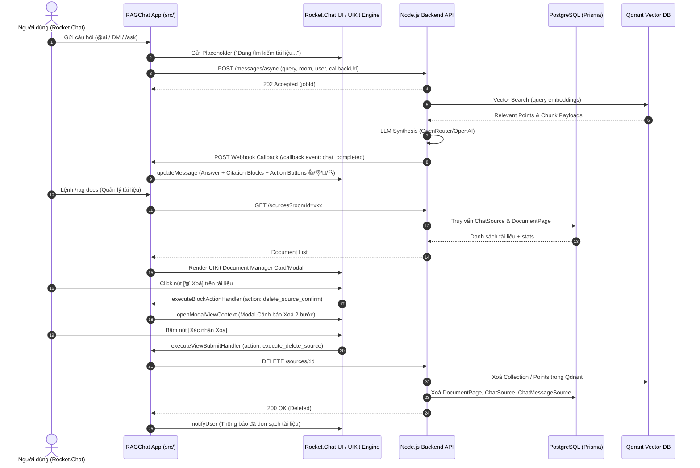

# RAGChat SDK & UI/UX Enhancement Blueprint (`src/`)

Tài liệu này tổng hợp toàn bộ đặc tả chức năng, kiến trúc tương tác người dùng (UI/UX), cơ chế minh bạch RAG (Observability) và hệ thống quản trị vòng đời tài liệu (Document Lifecycle & Governance) cho ứng dụng Rocket.Chat App (`src/`) và tầng Backend.

---

## 1. Tổng quan & Mục tiêu

Hiện tại, tầng tích hợp của RAGChat đã hoàn thiện luồng **bất đồng bộ (Async Queue Worker + Webhook Callback)**. Mục tiêu của giai đoạn phát triển này là nâng cấp tầng SDK (`src/`) từ giao diện văn bản cơ sở (Markdown thô) thành **Trợ lý AI Doanh nghiệp tương tác cao (Enterprise Interactive AI Assistant)** trên nền tảng Rocket.Chat Apps-Engine.

### 2 Trụ cột cốt lõi:
1. **Tối ưu trải nghiệm tương tác người dùng (Interactive UIKit & Contextual UX):** Cung cấp các nút tương tác nhanh, menu ngữ cảnh chuột phải, modal cấu hình, thông báo riêng tư và phản hồi đa bước.
2. **Minh bạch và Quản trị vòng đời tài liệu RAG (RAG Transparency & Knowledge Governance):** Giúp người dùng biết chính xác câu trả lời được trích xuất từ tài liệu nào, đoạn văn bản nào, đồng thời cung cấp công cụ kiểm tra, phát hiện tài liệu lỗi thời/trùng lặp và xoá tài liệu an toàn khỏi hệ thống (PostgreSQL + Qdrant).

---

## 2. Sơ đồ Kiến trúc Tương tác Toàn diện



---

## 3. Đặc tả Chi tiết các Tính năng Tương tác Người dùng (UI/UX)

### 3.1. Bộ nút Thao tác Dưới Câu trả lời (Message Action Blocks)
Dưới mỗi câu trả lời từ AI, hệ thống gắn kèm một khối UIKit Actions:

* **👍 / 👎 (Thumbs Up / Down - Phản hồi chất lượng):**
  * Người dùng đánh giá câu trả lời đúng hay sai.
  * App gửi telemetry về `POST /api/v1/integrations/rocketchat/feedback` để lưu vào bảng `AuditLog` hoặc cải thiện thuật toán Retrieval.
* **🔄 Tạo lại câu trả lời (Regenerate):**
  * Gửi lại truy vấn với cấu hình mở rộng (temperature cao hơn, hoặc nới lỏng score threshold của Qdrant).
* **📋 Sao chép nhanh (Copy Markdown/Snippet):**
  * Sao chép nội dung câu trả lời hoặc code block ra clipboard.
* **🔍 Xem trích đoạn gốc (Inspect Chunks):**
  * Mở Modal hiển thị toàn bộ nội dung thô của các đoạn tài liệu được đưa vào context LLM.

### 3.2. Menu Ngữ cảnh Chuột phải vào Tin nhắn (Message Context Actions)
Tích hợp trực tiếp vào menu ngữ cảnh của Rocket.Chat thông qua `UIActionButtonContext.MESSAGE_ACTION`:

* 📝 **"Tóm tắt chuỗi hội thoại này" (Summarize Thread):** Tự động thu thập các tin nhắn trong thread và trả về bản tóm tắt ngắn gọn.
* ❓ **"Hỏi AI về tin nhắn này" (Ask AI Contextually):** Lấy nội dung tin nhắn làm tiền đề câu hỏi cho RAG.
* 🌐 **"Dịch tin nhắn này" (Translate):** Dịch nhanh tin nhắn sang ngôn ngữ đích (Tiếng Việt / Tiếng Anh) qua modal chọn ngôn ngữ.
* 📚 **"Lưu tin nhắn vào Knowledge Base" (Index Message):** Cho phép Admin lưu các thảo luận quan trọng hoặc giải pháp kỹ thuật trong chat thành một tài liệu tri thức RAG mới.

### 3.3. Thông báo Riêng tư (Ephemeral Notifications)
* Sử dụng `modify.getNotifier().notifyUser(user, message)` cho các tác vụ mang tính cá nhân:
  * Thông báo lỗi (sai cú pháp lệnh, thiếu quyền truy cập).
  * Hướng dẫn sử dụng (`/rag help`, `@ai help`).
  * Danh sách tài liệu nhạy cảm hoặc cấu hình cá nhân.
* **Lợi ích:** Tránh làm loãng hoặc spam nội dung trong các kênh thảo luận đông người.

### 3.4. Gợi ý Khởi động (Suggestion Chips & Onboarding)
* Khi người dùng mở DM mới với Bot hoặc gõ `@ai start`, Bot sẽ gửi một Welcome Banner tương tác gồm các **Suggestion Chips**:
  * `[💡 Tóm tắt dự án]`
  * `[🔍 Tìm tài liệu API]`
  * `[❓ Quy định nghỉ phép & phúc lợi]`
  * `[📚 Quản lý tài liệu (/rag docs)]`
* Người dùng chỉ cần click vào chip để kích hoạt câu hỏi mẫu.

---

## 4. Minh bạch Nguồn & Quản trị Tài liệu RAG

### 4.1. Minh bạch Nguồn trong từng Câu trả lời (Per-Response Attribution)
* **Huy hiệu Độ phù hợp trực quan (Confidence Badges):**
  * 🟢 **> 80%:** Khớp ngữ nghĩa cao (*High Confidence*).
  * 🟡 **60% - 80%:** Khớp trung bình (*Medium Confidence*).
  * 🔴 **< 60%:** Khớp mức thấp, cần kiểm chứng (*Low Confidence*).
* **Cấu trúc Nguồn đính kèm:**
  ```text
  📄 [Tên File/Tài liệu] — Trang/Mục cụ thể (🟢 88% Khớp)
  > "...đoạn trích dẫn 2-3 câu chứa thông tin then chốt..."
  ```

### 4.2. Trình Quản lý Kho Tài liệu (`/rag docs` / `@ai docs`)
Cung cấp giao diện UIKit Card hoặc Modal để xem toàn bộ tài liệu đang được index cho kênh/workspace:

```text
📚 KHO TÀI LIỆU RAG CỦA PHÒNG (#general)
━━━━━━━━━━━━━━━━━━━━━━━━━━━━━━━━━━━━━━━━━━━━━
1. 📄 bao-cao-tai-chinh-2026.pdf
   • Chunks: 32 | Ngày tải: 28/08/2026 | Tải bởi: @hai.nguyen
   • Trạng thái: 🟢 Đang hoạt động (15 lượt truy vấn)
   [🔍 Xem Chunks]  [🗑️ Xoá]

2. 📄 quy-dinh-cu-2025.docx
   • Chunks: 14 | Ngày tải: 12/01/2026 | Tải bởi: @admin
   • Trạng thái: ⚠️ Bản cũ (Đã có quy-dinh-moi-2026.pdf)
   [🔍 Xem Chunks]  [🗑️ Xoá bản cũ]

3. 📄 huong-dan-loi.txt
   • Chunks: 0 | Ngày tải: 01/09/2026 | Tải bởi: @user1
   • Trạng thái: ❌ Lỗi Index (File rỗng)
   [🔄 Thử lại]     [🗑️ Xoá bỏ]
━━━━━━━━━━━━━━━━━━━━━━━━━━━━━━━━━━━━━━━━━━━━━
[📤 Tải lên tài liệu mới]   [🧹 Quét tài liệu rác (/rag prune)]
```

### 4.3. Phát hiện & Gợi ý Xóa Tài liệu Lỗi thời / Trùng lặp
Hệ thống áp dụng 3 quy tắc phân loại tài liệu cần xóa:

1. **Tài liệu Trùng lặp / Phiên bản thay thế (Superseded/Duplicate Docs):**
   * Khi người dùng upload file mới có tên tương tự (hoặc nội dung tương đồng > 90%), Bot sẽ phát hiện và hiển thị cảnh báo:
     > ⚠️ *Đã phát hiện file cũ `bang-gia-v1.pdf` tải lên ngày 15/07. Bạn có muốn dọn dẹp file cũ không?* `[🗑️ Xoá bản cũ]` `[Giữ cả hai]`
2. **Tài liệu Lỗi Index (Failed / Corrupted Chunks):**
   * Các file parse lỗi hoặc sinh ra 0 chunks sẽ được gắn nhãn đỏ kèm nút xoá dọn rác nhanh.
3. **Tài liệu Mồ côi / Không còn sử dụng (Stale Documents):**
   * Lệnh `/rag prune` quét các tài liệu không phát sinh bất kỳ retrieval hit nào trong hơn 60 ngày để gợi ý Admin dọn dẹp bộ nhớ Vector.

### 4.4. Quy trình Xóa Tài liệu An toàn 2 bước (Safe 2-Step Deletion)
Nhằm tránh việc người dùng vô tình bấm xoá mất dữ liệu quan trọng:
1. Người dùng bấm **`[🗑️ Xoá]`** trên giao diện danh sách.
2. Bot mở một **Confirmation Modal**:
   * Tiêu đề: `Xác nhận xoá tài liệu RAG`
   * Nội dung: *"Bạn có chắc chắn muốn xoá vĩnh viễn tài liệu **`quy-dinh-cu.docx`**? Thao tác này sẽ xoá 14 vector chunks trong Qdrant và cơ sở dữ liệu. Bot sẽ không còn nhớ nội dung tài liệu này nữa."*
   * 2 Nút: `[Huỷ bỏ]` và `[Xác nhận Xoá (Đỏ)]`.
3. Khi bấm xác nhận, hệ thống:
   * Xoá vector trong Qdrant.
   * Xoá bản ghi `ChatMessageSource`, `DocumentPage`, `ChatSource` trong PostgreSQL.
   * Gửi thông báo hoàn tất cho người dùng.

---

## 5. Đặc tả Kỹ thuật API Tích hợp (Contract Specs)

### 5.1. Backend REST API Endpoints Mới

#### 1. Lấy danh sách tài liệu theo Phòng / Workspace
* **Method:** `GET /api/v1/integrations/rocketchat/sources`
* **Query Params:** `workspaceId`, `roomId`
* **Response:**
  ```json
  {
    "statusCode": 200,
    "data": {
      "sources": [
        {
          "id": "src_12345",
          "filename": "bao-cao-tai-chinh-2026.pdf",
          "totalPages": 32,
          "chunksCount": 32,
          "createdAt": "2026-08-28T10:00:00.000Z",
          "uploadedBy": "hai.nguyen",
          "hitCount": 15,
          "status": "ACTIVE",
          "isDuplicate": false
        }
      ]
    },
    "message": "Sources retrieved successfully"
  }
  ```

#### 2. Xóa tài liệu khỏi RAG (Postgres + Qdrant)
* **Method:** `DELETE /api/v1/integrations/rocketchat/sources/:id`
* **Headers:** `Authorization: Bearer <ROCKETCHAT_INTEGRATION_TOKEN>`
* **Response:**
  ```json
  {
    "statusCode": 200,
    "data": {
      "id": "src_12345",
      "deleted": true,
      "vectorsRemoved": 32
    },
    "message": "Source and vector embeddings deleted successfully"
  }
  ```

#### 3. Ghi nhận Đánh giá chất lượng (Feedback)
* **Method:** `POST /api/v1/integrations/rocketchat/feedback`
* **Body:**
  ```json
  {
    "messageId": "msg_98765",
    "chatMessageId": "cm_45678",
    "rating": "positive",
    "feedbackText": "Thông tin rất chính xác",
    "userId": "usr_rocketchat"
  }
  ```

---

## 6. Cấu trúc Thư mục Nâng cấp của `src/`

```text
src/
├── api/
│   └── CallbackEndpoint.ts        # Nhận webhook sự kiện chat & indexing từ backend
├── commands/
│   ├── AskCommand.ts              # /ask "câu hỏi"
│   ├── RagCommand.ts              # [MỚI] /rag [docs | prune | help | settings]
│   ├── SearchCommand.ts           # /search "từ khoá"
│   ├── SummarizeCommand.ts        # /summarize "văn bản"
│   ├── ExplainCommand.ts          # /explain "khái niệm"
│   └── TranslateCommand.ts        # /translate "văn bản"
├── handlers/
│   ├── ActionButtonHandler.ts     # [MỚI] Xử lý chuột phải vào tin nhắn
│   ├── BlockActionHandler.ts      # [MỚI] Xử lý click button (Feedback, Delete, Regenerate)
│   ├── ViewSubmitHandler.ts       # [MỚI] Xử lý submit form từ Modal
│   ├── BotMessageHandler.ts       # Xử lý DM trực tiếp 1-1 với Bot
│   ├── MentionHandler.ts          # Xử lý @bot trong kênh
│   └── FileUploadHandler.ts       # Đón bắt file tải lên để index
├── lib/
│   ├── BackendClient.ts           # Gọi API sang backend (kèm CRUD sources & feedback)
│   └── BackendTypes.ts            # Kiểu dữ liệu & Schemas
├── persistence/
│   └── sessionStore.ts            # Lưu lịch sử chat trên Rocket.Chat Persistence
├── settings/
│   └── Settings.ts                # Khai báo cấu hình Admin
├── uikit/                         # [MỚI] Module giao diện UIKit
│   ├── blocks/
│   │   ├── ActionButtonsBlock.ts  # Khối nút 👍 👎 🔄 🔍
│   │   ├── DocumentListBlock.ts   # Khối danh sách tài liệu
│   │   ├── SuggestionChipsBlock.ts# Khối gợi ý câu hỏi mẫu
│   │   └── SourceCardsBlock.ts    # Khối thẻ nguồn trích dẫn
│   └── modals/
│       ├── ConfirmDeleteModal.ts  # Modal xác nhận xóa tài liệu 2 bước
│       ├── SourceDetailModal.ts   # Modal xem chi tiết chunk nội dung gốc
│       └── RagSettingsModal.ts    # Modal cấu hình workspace & persona
└── utils/
    ├── Formatter.ts               # Định dạng Markdown & UI Attachments
    ├── Logger.ts                  # Logger tích hợp
    ├── MessageHelper.ts           # Helper gửi/sửa tin nhắn & notifyUser
    ├── SettingReader.ts           # Đọc an toàn cấu hình
    └── Validator.ts               # Kiểm tra tính hợp lệ dữ liệu
```

---

## 7. Lộ trình Triển khai (Phasing Roadmap)

| Giai đoạn | Nhiệm vụ chính | Trọng tâm bàn giao |
|---|---|---|
| **Phase 1: Backend CRUD & Transparency APIs** | • Thêm `DELETE /sources/:id` (dọn sạch Postgres + Qdrant).<br>• Thêm `GET /sources` (lọc theo room/workspace).<br>• Thêm `POST /feedback` (lưu audit telemetry). | Backend sẵn sàng phục vụ quản trị dữ liệu RAG. |
| **Phase 2: UIKit Blocks & Action Handlers** | • Triển khai `IUIKitInteractionHandler` trong `RagChatApp.ts`.<br>• Tạo `BlockActionHandler` cho Feedback (👍/👎) và Regenerate.<br>• Thêm `ActionButtonHandler` cho menu chuột phải tin nhắn. | Nâng cao tương tác trực tiếp trên từng tin nhắn. |
| **Phase 3: Quản lý & Xóa Tài liệu An toàn** | • Tạo lệnh `/rag docs`.<br>• Xây dựng `DocumentListBlock` và `ConfirmDeleteModal`.<br>• Hoàn thiện luồng xác nhận xoá 2 bước gọi Backend. | Người dùng nắm quyền kiểm soát kho tài liệu RAG. |
| **Phase 4: Smart Detection & Prune Tooling** | • Phát hiện file trùng lặp/bản cũ khi tải lên.<br>• Thêm lệnh `/rag prune` dọn dẹp tài liệu lỗi/mồ côi. | Tự động hoá quản trị chất lượng dữ liệu RAG. |
